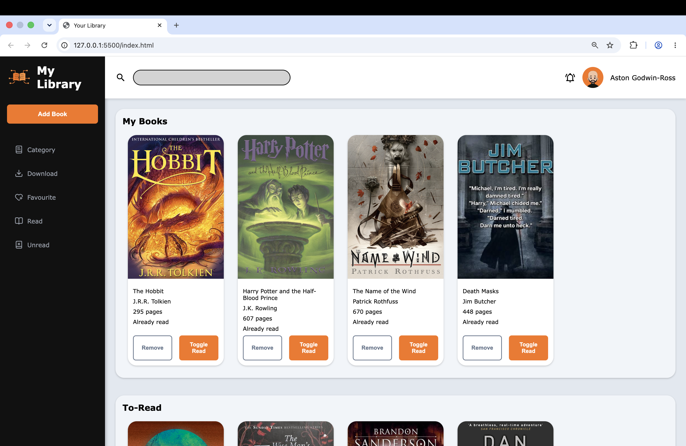

# My Library

A library web app where users can add, remove, and track the books in their collection. Each book records its title, author, page count, and read status, and books are organised into "My Books" (read) and "To-Read" (unread) sections. Built as part of The Odin Project's JavaScript course.

## Features

- **Add books** via a modal form (title, author, pages, and read status).
- **Remove books**, guarded by a custom confirmation modal.
- **Toggle read status** — books move automatically between the "My Books" and "To-Read" sections.
- **Dynamic rendering** — the display is rebuilt from a single source-of-truth array whenever the data changes.
- **Book covers** — sample books show real cover images, and books added through the form fall back to a placeholder.
- Responsive card grid, a custom toggle switch, and a dark sidebar with a hand-made logo.

## What I practised

- JavaScript object constructors, prototypes, and `this`.
- Keeping data (an array of book objects) separate from the display, and re-rendering from that data.
- DOM manipulation: creating, configuring, and appending elements; event listeners; form handling with `event.preventDefault()`.
- Refactoring into small, single-responsibility functions.
- CSS Grid and Flexbox layouts, the `<dialog>` element for modals, and a custom CSS toggle switch using the `:checked` pseudo-class.

## Built with

- HTML
- CSS
- JavaScript (vanilla)
